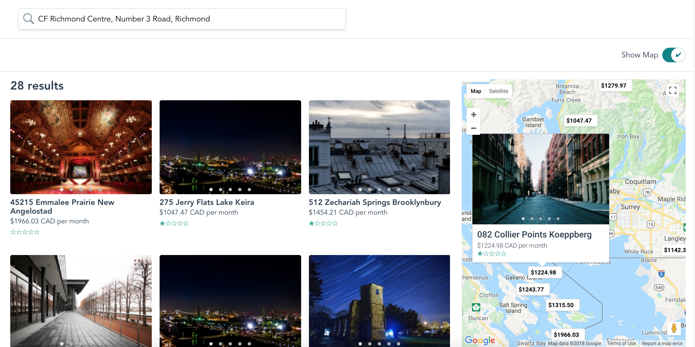

# Airbnb Map Search Page

This repo recreates airbnb map search page using vue. It demonstrates:

* use Vue to implement a complicated page
* use google map api for autocomplete address when searching
* adding multiple markers on google map
* customize markers, labels and info window.
* dynamical fetch data based on google map boundary



Play it on [code sandbox](https://ry30v3x0lo.codesandbox.io/)

## Installation

* Clone the repo
* Create a env file in the root directory
* Add your google map key in the env file

```env
// your env file
VUE_APP_GOOGLE_MAP_KEY=your_google_map_key
```

* Install dependencies

```bash
npm install
```

* Build the assets

```bash
npm run build
```

* Start the server

```bash
npm run serve
```

* Visit the site __http://localhost:8080/__ in your browser.
